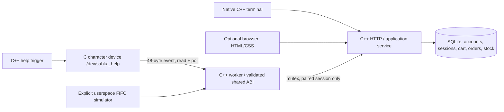

# Embedded Linux deployment and evaluation

## Architecture



The CPU executes the application in userspace. open/read/write/poll cross the system-call boundary into the kernel. The C driver implements file operations and transfers a fixed-width record through copy_to_user. Its wait queue wakes blocked poll/read callers after an accepted HELP write. The application worker shares database state with HTTP threads under a mutex. SQLite transactions keep stock and order changes atomic. SIGINT/SIGTERM are blocked in workers and consumed by the shutdown thread with sigwait.

This models a kiosk help-button interface but has no physical interrupt source. A real GPIO design would require a board-specific GPIO/IRQ handler and hardware tests. The existing write command is an educational test trigger, not evidence of physical input.

## Device contract

Only the five-byte command `HELP\n` is accepted. One event may be pending; another write returns EBUSY. An idle nonblocking read returns EAGAIN. A too-small buffer returns EINVAL without consuming the event. poll reports readable while pending and writable when empty.

The shared C/C++ record is 48 bytes: sequence (__u32), kiosk ID (__u32, 101), realtime nanoseconds (__u64), source char[32]. C++ compile-time size/offset assertions and payload checks detect incompatible data. It is a local native-endian Linux ABI, not a network serialization format. FIFO input uses bounded line framing so partial/combined writes do not create arbitrary events. Only the last event is retained in the paired shopping session; this is not a durable multi-event queue.

Pairing is explicit and the last paired session wins. It is cleared on server restart or account logout. A request never opens help for every user. The browser must refresh or the CLI must enter Help to retrieve it.

## Driver build on a compatible host

First run the compiled readiness checker:

```bash
build/backend/sabka_diagnostics
```

Current observed host: Ubuntu/WSL x86-64, kernel 6.6.87.2-microsoft-standard-WSL2. Matching kernel build tree absent; /dev/sabka_help absent. C++ protocol tests do not prove the kernel module works.

On a Linux host with matching configured kernel build files, copy the driver folder to a Linux-native path without spaces (for example ~/sabka-driver). Then:

```bash
cd ~/sabka-driver
make
modinfo sabka_help_driver.ko
```

Kbuild requires the configured build tree for the target kernel. Do not install unrelated generic headers and assume they match WSL. Follow the [official external-module documentation](https://docs.kernel.org/kbuild/modules.html).

Loading changes running kernel state and needs administrator authorization on that host. After reviewing/authorizing the module, the host operator can run:

```bash
sudo insmod ./sabka_help_driver.ko
# Grant only the intended kiosk user access, using your actual Linux username:
sudo chown YOUR_LINUX_USERNAME /dev/sabka_help
sudo chmod 600 /dev/sabka_help
```

With the backend listener stopped, from the project root:

```bash
build/backend/sabka_device_test --device
```

Then launch the backend with `/dev/sabka_help` replacing `--fifo`, pair a session, and run `sabka_help_trigger /dev/sabka_help`. Stop userspace processes before the authorized operator runs `sudo rmmod sabka_help_driver`. No module loading, permission changes or boot/kernel modifications were performed during this development session.

## Optional per-user installation

No root service or boot changes are needed for the userspace demo:

```bash
cmake --install build --prefix "$HOME/.local"
mkdir -p "$HOME/.config/systemd/user"
cp "$HOME/.local/share/sabka-bazaar/sabka-bazaar.service" "$HOME/.config/systemd/user/"
systemctl --user daemon-reload
systemctl --user start sabka-bazaar
journalctl --user -u sabka-bazaar -n 30
systemctl --user stop sabka-bazaar
```

These are optional operator commands, not automatically executed. The unit uses ~/.local binaries/assets, a private ~/.local/state/sabka-bazaar/shop.sqlite database, restrictive umask and no-new-privileges. It uses FIFO mode, not an installed kernel module. No automatic boot enablement is performed. The service database is separate from backend/demo.sqlite; promote an admin against the database actually in use.

## Evaluation: 5–10 minutes

1. Explain the C++ server, native terminal client, SQLite and C kernel boundary.
2. Run diagnostics and state the missing real-module evidence clearly.
3. Register/login in the CLI; show alias search, cart, checkout and persisted order.
4. Demonstrate shopper rejection of order advancement, then an authenticated admin advancing it.
5. Pair kiosk, write FIFO event, show only that session receiving it; explain poll/wait queue difference.
6. Show tests and Git history. Explain RAII, transactions, Unicode normalization, hashed passwords and session expiry.

A physical embedded-board deployment is future verification, not a completed claim. The source targets Linux and can be built natively on an appropriately provisioned Linux board; no ARM build or board performance measurement has been run here.
